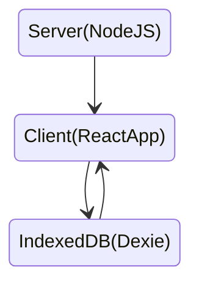

# Movie APP

### Overview

- Movie-app client side is built on top of React.js and Typescript. It uses [Material UI](https://mui.com/) system and [React-Admin](https://marmelab.com/react-admin/) library.

- For movie-app Nodejs server, its whole architecture is based on [Express](https://expressjs.com/) Nodejs library.

- For database, I use [Dexie](https://dexie.org/docs/Tutorial/React) library to storage movies data. Dexie.js is based on [indexedDB](https://developer.mozilla.org/en-US/docs/Web/API/IndexedDB_API) and it is for client-side storage of significant amounts of structured data.

*  Requires Node version (v16.14.2)
*  Requires Yarn version (v1.22.0 or greater).


### Run app service in local

  #### Run app server by downloading docker image
  you can download docker image from docker hub

  ```
  docker pull jerryyanwang/movieapp
  docker run --rm -it -p 3000:3000/tcp jerryyanwang/movieapp:latest
  open http://localhost:3000/#/movieResource
  ```

  #### Run app server by docker compose
  Pull whole app from github and access root directory of app
  you can open `docker-compose.yml` file to check relevant docker configuration

  ```
  docker-compose up
  open http://localhost:3000/#/movieResource

  docker-compose stop
  ```

### Development by local
pull whole app from github and access root directory of app

  #### Run Node server

  ```
  yarn
  yarn start
  open http://localhost:3000
  ```

  #### Run Client server

  ```
  cd ./client
  yarn
  yarn start
  open http://localhost:3000/#/movieResource
  ```

###  Application Data Flow



###  Pre-commit Hooks
We set up two git pre-commit hooks:

1. `prettier` - this will check the js file and formate it automatically.
2. `@typescript-eslint` - this will check the ts file if there have any linter problems.


### Front-end File Structure
```
└── /src
  ├── /components - reusable components like navigation bar, buttons, forms
  ├── /hooks - Contains common hook function
  ├── /providers - Contains all provider context
  ├── /utils - utilities, helpers, constants.
  ├── /views/pages - majority of the app pages would be here
  ├── index.tsx
  └── App.tsx
```
Reference: [React File structure](https://reactjs.org/docs/faq-structure.html)